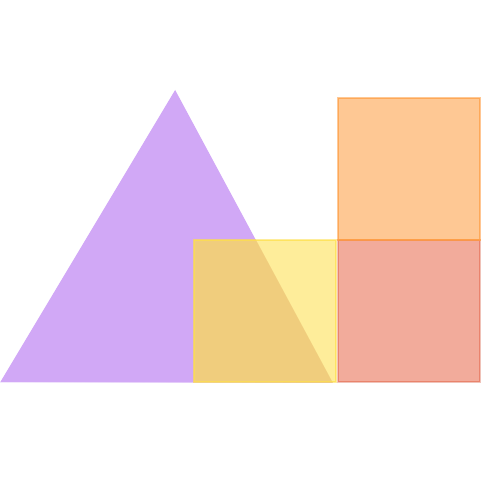

  
  <h3 style="font-size: 50px;" align="center">📘w3ba11y - User Manual</h3>
  

    <em>"For better accessibility and seo optimization..."</em>
     
    <a href="https://github.com/Rikicavaz77/Stage-Docs"><strong>Explore the docs »</strong></a>
  

  
<strong>Table of Contents</strong>

  <ol>
    <li>
      📦<a href="#about-the-project">About The Project</a>
      <ul>
        <li>🛠️<a href="#built-with">Built With</a></li>
      </ul>
    </li>
    <li>
      🔧<a href="#getting-started">Getting Started</a>
      <ul>
        <li>⚙️<a href="#prerequisites">Prerequisites</a></li>
        <li>💾<a href="#installation">Installation</a></li>
      </ul>
    </li>
    <li>🚀<a href="#usage">Usage</a></li>
    <li>🐞<a href="#bug-report">Bug Report</a></li>
    <li>📄<a href="#license">License</a></li>
    <li>📬<a href="#contact">Contacts</a></li>
    <li>📝<a href="#credits">Credits</a></li>
  </ol>

<!-- ABOUT THE PROJECT -->
## About The Project

### Built With

<!-- GETTING STARTED -->
## Getting Started

### Prerequisites

### Installation

<!-- USAGE -->
## Usage

<!-- BUG REPORT -->
## Bug report

<!-- LICENSE -->
## License

<!-- CONTACTS -->
## Contact

<!-- CREDITS -->
## Credits
